TaintAnalysis
===
### Course ECSE 688 (Automated Software Testing and Analysis) — First Assignment

#### By Victor Guerra Veloso

victor.guerraveloso@mail.mcgill.ca

Student ID: 261193941

## Table of Contents

- [Design Evolution](#design-evolution)
- [Implementation details](#implementation-details)
- [Compiling and Running (CLI)](#compiling-and-running-cli)
- [Compiling and Running (IDE)](#compiling-and-running-intellij-idea--recommended)
- [Tests result](#tests-result)
- [Open Output](#open-output)

## Design Evolution

In this section, we discuss the changes introduced by 15 out of the 18 commits in this repository. 

### Initial Commit (7a6afb9)

The first commit adds the TaintAnalysis prototype provided in the assingnment specification, which includes the build configuration file `pom.xml` and two source code files (`MainDriver.java` and `TaintAnalysis.java`).

### Create new structure that introduces Map API to FlowSet (8802340) and Replace FlowSet with FlowMap (9bf9d04)

The second commit adds my first contribution, the **FlowMap** (see Section [FlowMap](#flowmap) for more details).
And the third commit systematically replaces every use of `FlowSet<Value>` with `FlowMap<Unit, Value>` in the `TaintAnalysis.java` file.

### Introduce constructor param for sink and source filename + read files (0b6f9f3) and Implement constructor (support sinks file, line number, and proper report) (e6be139)

These commits adapts the `TaintAnalysis` constructor prototype to support reading sinks and sources from external files:

- First, it introduces new string parameters, *e.g.*, `sinkFile` and `sourceFile`, which hold the filepath of `sink.txt` and `source.txt`, respectively.
- Next, it reads those files line-by-line and add to the new list fields.
- Then, it iterates the list of sinks and checks whether the current node invokes a sink method.
- Notice that, we extracted the if-statement condition to a method `isInvocationOf`, which is parameterized by node and signature of the expected method invocation.
- After that, we leverage FlowMap to support many sinks by reporting all mapped leaks. 
- Finally, the print statements are updated according to the assignment's specification.

These commits also include (to lines 39, 58, and 59) statements that were recommended by the README.md provided in the assignment specifications (see more in [Collecting line numbers](#collecting-line-numbers)). 

### Implement flowThrough (c3d5253)

This commit implements our ExplicitFlow Transfer Functions in the `flowThrough` method. See implementation details in [Section (Explicit Flow) Transfer Functions](#explicit-flow-transfer-functions).

### Adapt MainDriver to pass filenames and handle exceptions (cc87110)

This commit is an important milestone of the project. 
By adapting `MainDriver.java` to accomodate the changes in the `TaintAnalysis.java`, we are finally able to run the software and manually test it.
The changes introduced in this commit include:

- Moving configuration statement (see [Collecting line numbers](#collecting-line-numbers)) from `TaintAnalysis.java` to `MainDriver.java`
- Extending the CLI to support inputting the project root's, the sink file's, and the source file's path.
- Adapting IntraTaintTransformer to propagate the obtained filepaths to TaintAnalysis.

### Address missing key in FlowMap.add (0de912c)

Running our program revealed a simple bug in `FlowMap.add(K,V)`.
This commit fixes the bug by assigning an empty ArraySparseSet to new keys in the FlowMap.
After that, our program could spot its first leak!

### Add recursion to isInvocationOf (1bc68ad)

This commit leverages the `Unit.getUnitBoxes()` to recursively call isInvocationOf on boxes inside boxes, that is locating method invocations that are part of a composite statement (e.g., first unit in `OpenOutputTests.array()`).

### Enable taintValues with different source other than the current statement + fix findUsedTaintedValue with it (62397ee)

At this point, we were missing Leaks due to the mispropagation of tainted values to defined values. 
For instance, in Figure 2, z should be tainted because a tainted value (x) was used in its definition.
That is, when processing the line 16, the parameter `Unit stmt` of `taintValues` would hold the statement of line 14 to "propagate" it to another value being tainted.
However, the buggy `taintValues` method was tainting the value defined in the source statement (line 14) rather than the current statement (line 16), so x would be tainted again.

Listing 1 shows how adding a third optional parameter fixed that issue (increasing the total number of detected leaks from one to nine). 
Back to our example, in the new `taintValues` signature, `Unit affected` represents line 16 while `Unit src` corresponds to line 14

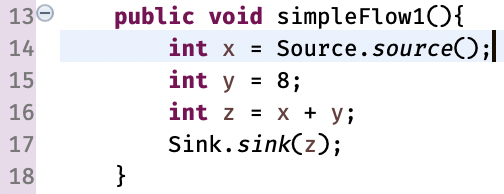
*Figure 2: test case where tainted value x should propagate to z*

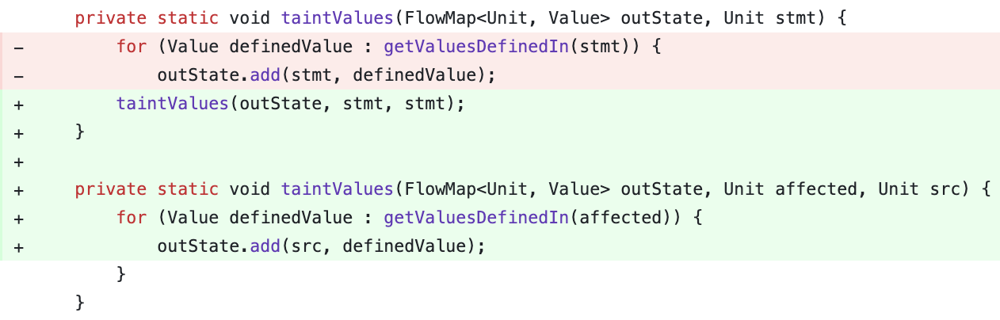
*Listing 1: TaintValues receives a third optional parameter*

### Add test + propagate detected leaks (9e6a973) and Override FlowMap.toString for debugging (a7619fc) and Update tests + FIX multiTaint2 where two leaks share the same sink (693c146)

These commits add test support, a test suite, and fix some bugs in the `TaintAnalysis` class detected by the introduced tests.

### implement implicit flow + enable supplying algorithms in untaintValues (a485937) and Fix implicit flow analysis and enable supplying algorithms in taintValues + renames (8ac5c45)

These commits add support for Implicit Flow (see more in [Implicit Flow](#implicit-flow)) and make `taintValues` and `untaintValues` more flexible.

## Implementation details

Figure 1 illustrates the latest design of this assignment. 
This section describes, in detail, our implementation and design choices.

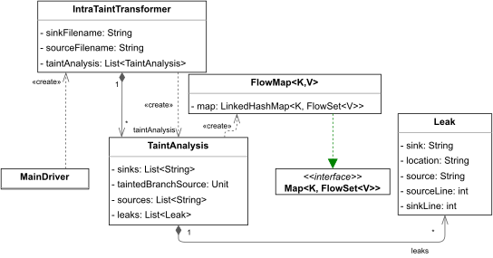
*Figure 1: Class diagram of TaintAnalysis showing fields and dependencies among classes*

### FlowMap
Inspired by FlowSet's design, FlowMap adds support for multiple sources for each sink. 
Also, to preserve a certain level of interoperability, FlowMap implements most of the FlowSet's API, *e.g.*, intersection, difference, union, and copy.
Additionally, we addressed the difference between a Set and a Map by adapting some methods' signatures.
For example, `FlowSet<T> emptySet()` becomes `FlowMap<K,V> emptyMap()`, `union(FlowSet<T>)` becomes `union(FlowMap<K, V>)`, and `add(V)` delegates to `add(K, V)` when map has only one key.

As a consequence of the adaptations, FlowMap could not implement FlowSet.
Instead, we followed the "composition over inheritance" principle by 1) adding to FlowMap a field `map` of type `LinkedHashMap<K, FlowSet<V>>`, 2) implementing the `Map<K, FlowSet<V>>` interface, and 3) delegating all standard map-related methods to the parent interface.
Notice that, `clone()` was adapted to return a new `FlowMap<K, V>` rather than a `LinkedHashMap<K, FlowSet<V>>`.

### Collecting line numbers

The assignment specifications included a README.md file with some instructions and recommendations.
Among the recommendations, there are three statements that reportedly should enable, read, and get the line number of the original source code (or bytecode) statement corresponding to each Jimple node.
The first statement `Options.v().set_keep_line_number(true)` is essential to preserve in Jimple those line numbers.
However, the other statements do not work as intended and consistently throws a NPE (NullPointerException). 
That problem was identified and fixed in the commit [b466369](https://github.com/victorgveloso/TaintAnalysis/commit/b466369abfef0e14b4bf75cd22b7229800cc7101) (omitted from the ["Design Evolution" Section](#design-evolution)) by replacing the recommended statements with `Unit.getJavaSourceStartLineNumber()`.

### (Explicit Flow) Transfer Functions

In Soot, transfer functions are implemented in the `flowThrough` method.
Our implementation logic is divided in two main methods, `matchSources` and `findUsedTaintedValue`.
The former detects **source** invocations in the current node and taints the values defined in it.
The latter detects tainted values being assigned to variables, propagating the tainted status.
Note, when both methods fail we untaint the defined variables because no value used in the statement is tainted.

### Implicit Flow

We extend `flowThrough` to support Implicit Flow. 
That is, when a tainted value is used in an if-statement condition, we taint all values defined in that branch.
Our implementation takes advantage of the `Unit.branches()`, to identify where an if-statement begins, and `Unit.getBoxesPointingToThis()` to identify merging points, i.e., statements that are target of GOTOs.
When the beggining of an if-statement is detected, we check whether any value used in the condition is tainted and store it in a flag variable, `taintedBranchSource`.
When a merging point is detected, we reset the flag variable.
While the flag variable is set, *i.e.*, in between the if-statement and the merging point, all defined values are tainted.

### Automated Tests

Beyond manual execution of the program via its CLI, we implemented a JUnit 5 test suite and generated ten distinct versions of the code provided in the assignment specification. 
Each version is organized in separate folders in `src/test/resource` and corresponds to each method being analyzed. 
Each folder contains only the bytecode necessary for the method under analysis to run.
In addition, we designed three parameterized tests to run Soot in each folder and assert whether the obtained and expected results match.

- `testProgramToAnalyzeWithExpectedOutputs_OneLeak` tests only methods that should have a single leak, *i.e.*, `ImplicitFlow1`, `ImplicitFlow2`, `SimpleFlow1`, `SimpleFlow2`, `SimpleFlow3`, and `LongTaintChain`.
- `testProgramToAnalyzeWithExpectedOutputs_LeaksCount` tests whether the SUT can detect the correct number of leaks for all methods in `ProgramToAnalyzeWithExpectedOutputs`
- `testProgramToAnalyzeWithExpectedOutputs_ImplicitFlow` specifically targets ImplicitFlow, which was the latest supported feature implemented.

## Compiling and Running (CLI)

### Prerequisites (CLI)

- Java Development Kit 8 
- Maven
- Git

### Cloning (CLI)

```sh
git clone https://github.com/victorgveloso/TaintAnalysis.git

cd TaintAnalysis
```
### Compiling (CLI)

```sh
mvn compile
```

### Running the tests (CLI)

```sh
mvn test
```

### Apply to a specified path (CLI)

```sh
mvn package

java -cp target/TaintAnalysisScratch-1.0-SNAPSHOT.jar intraprocedural.MainDriver src/test/resources/InputBytecodes sink.txt source.txt
```
obs: replace `src/test/resources/InputBytecodes` with your project root path

### Troubleshooting (CLI)

`IllegalArgument Unsupported class file major version 64` 
- This error is thrown when using Java 9+

```
Error: Unable to initialize main class intraprocedural.MainDriver
Caused by: java.lang.NoClassDefFoundError: soot/Transformer
```
- This error is thrown when running the JAR without the soot in the classpath

```
Error: A JNI error has occurred, please check your installation and try again
Exception in thread "main" java.lang.NoClassDefFoundError: soot/Transformer
```
- This error is thrown when running and compiling the project with different Java versions. Stick to one version!

## Compiling and Running (Intellij IDEA / Recommended)

### Cloning (Intellij IDEA)

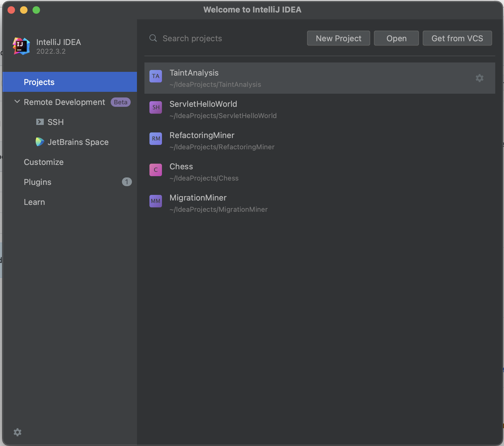
*Figure 3: Press the "Get From VCS" button in the Welcome window of Jetbrains Intellij IDEA.*


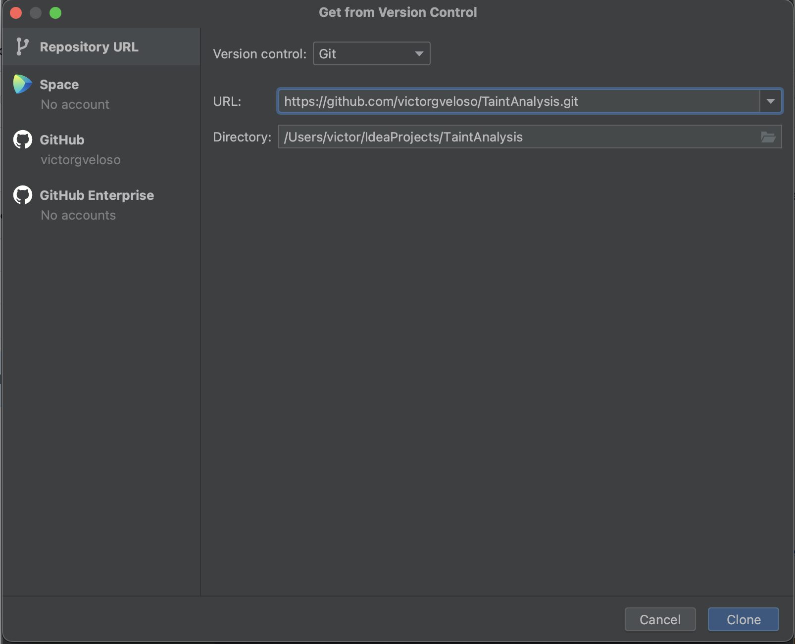
*Figure 4: Setup the git repository to clone from in the Version Control window*

### Compiling (Intellij IDEA)

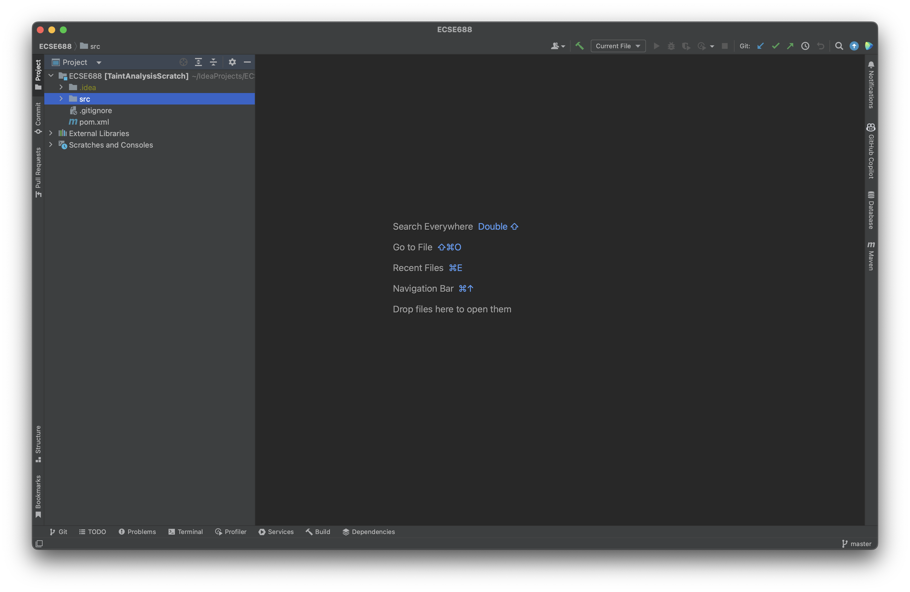
*Figure 5: Press the green hammer button in the toolbar to compile the project*

### Running the tests (Intellij IDEA)

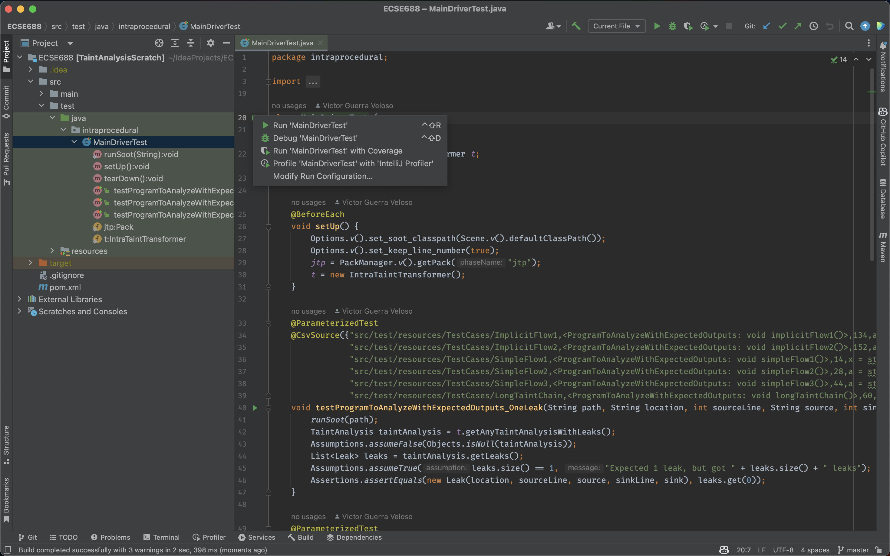
*Figure 6: Right click on src/test/java/intraprocedural/MainDriverTest.java and run the tests*

### Apply to a specified path (CLI)

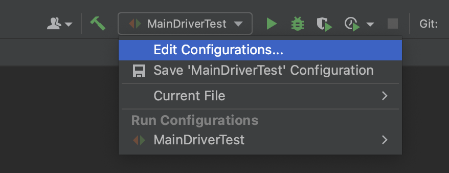
*Figure 7: To set up the CLI select "Edit Configurations..." n the dropdown menu of the toolbar*

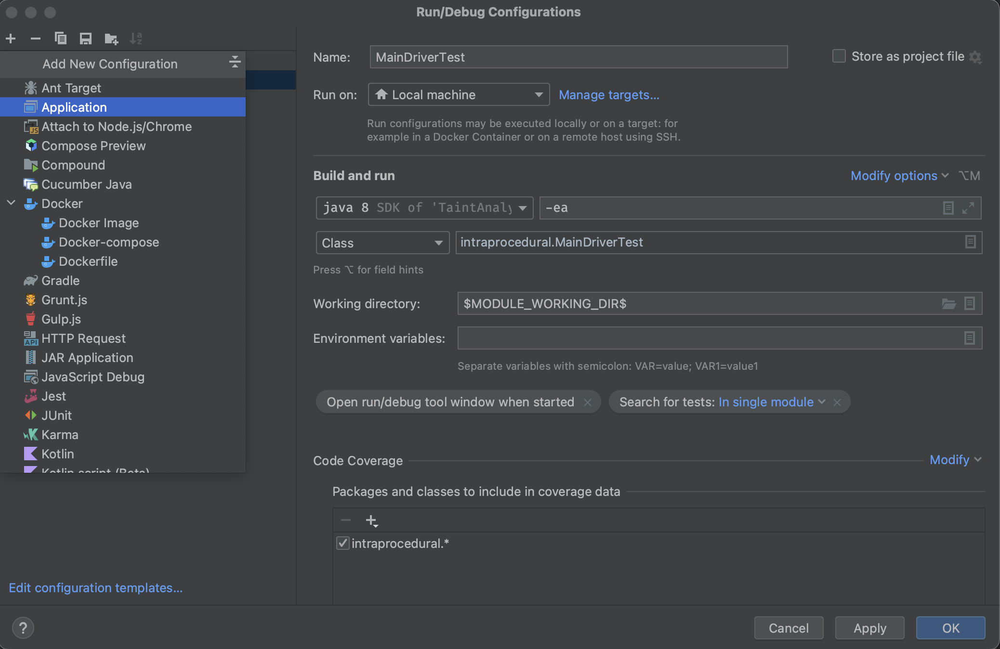
*Figure 8: Add a new configuration by pressing "+" and selecting "Application"*

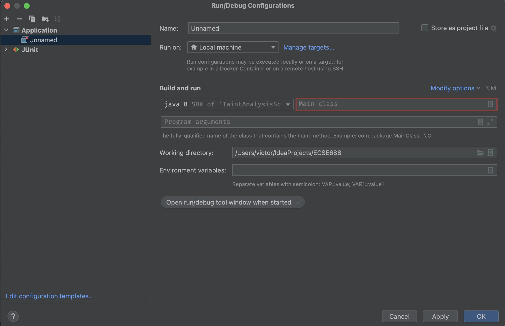
*Figure 9: Fill in the blank fields in the next window and click on the Main class menu options button*

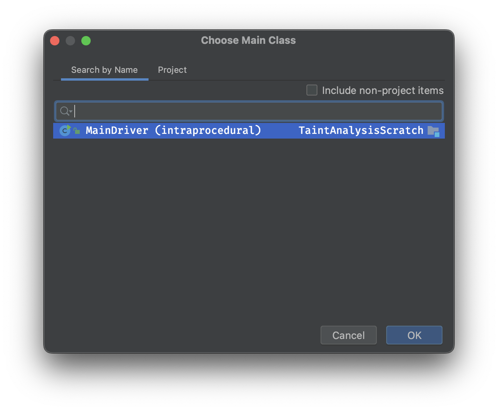
*Figure 10: In the new dialog window you should select MainDriver (intraprocedural) and press OK*

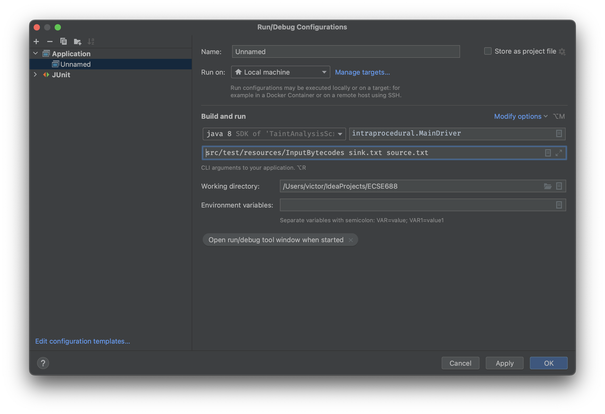
*Figure 11: In the CLI arguments entry box, write the path to the folder under analysis followed by "sink.txt" and "source.txt" (separated by space)*

### Troubleshooting (Intellij IDEA)

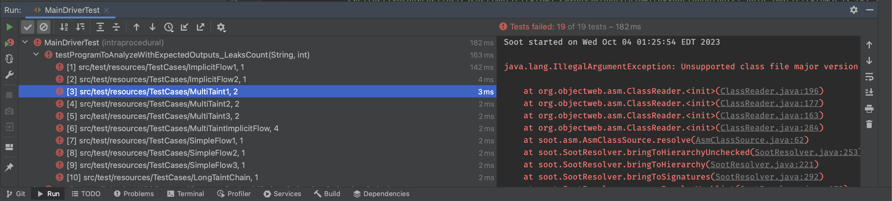
*Figure 12: When tests fails with IllegalArgumentException, you are likely using Java 9+ rather than 8*

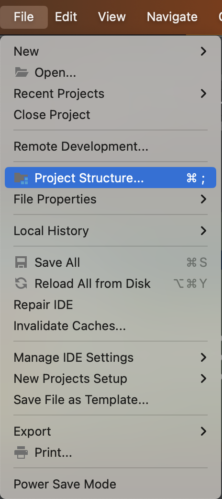
*Figure 13: Set up your project's Java interpreter by opening File>Project Structure... or simply press ⌘; (Mac)*

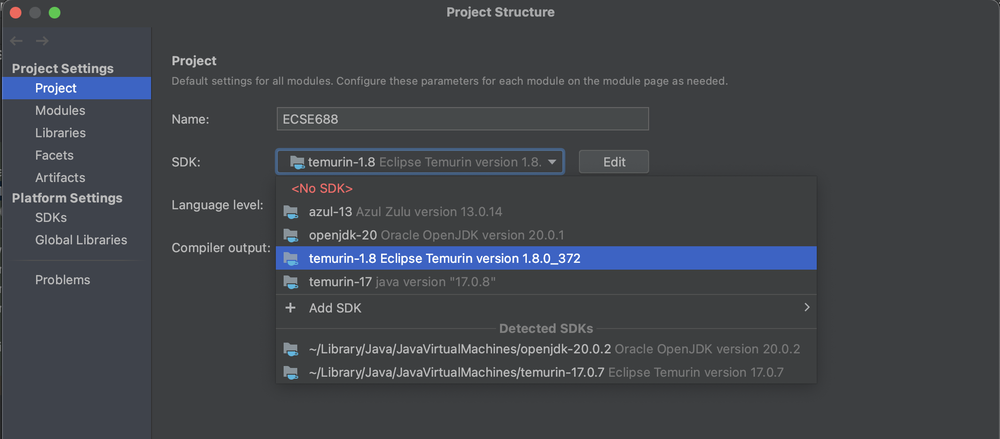
*Figure 14: In the project settings, select a Java 8 or 1.8 SDK*

## Tests result

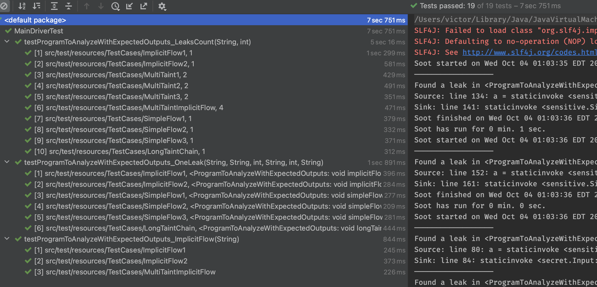
*Figure 15: Our test suite replicates each test case from the specification and should pass without problems*

## Open Output

My implementation is unable to detect leaks in the methods of the `OpenOutputTests.java` file. 
This section describes why it misses those cases and discusses opportunities and feasibility of extensions to support those cases.

### Array

Source code: 
```Java
public void array() {
   int[] array = new int[5];

   array[0] = Source.source();
   array[1] = 5;

   Sink.sink(array[1]);
}
```
*Listing 2: Fragment of code of the OpenOutputTests.array method from InputSources*

Decompiled bytecode:
```Java
public void array() {
   int[] var1 = new int[]{Source.source(), 5, 0, 0, 0};
   Sink.sink(var1[1]);
}
```
*Listing 3: Decompiled version of the bytecode of OpenOutputTests.array method from InputBytecodes*

Jimple:
```Scala
this := @this: OpenOutputTests
array = newarray (int)[5]
$stack3 = staticinvoke <sensitive.Source: int source()>()
i := @parameter0: int
return 1
return
array[0] = $stack3
array[1] = 5
$stack4 = array[1]
staticinvoke <sensitive.Sink: void sink(int)>($stack4)
return
return 1
i := @parameter0: int
return
```
*Listing 4: Fragment of the Jimple representation that corresponds to the OpenOutputTests.array method*

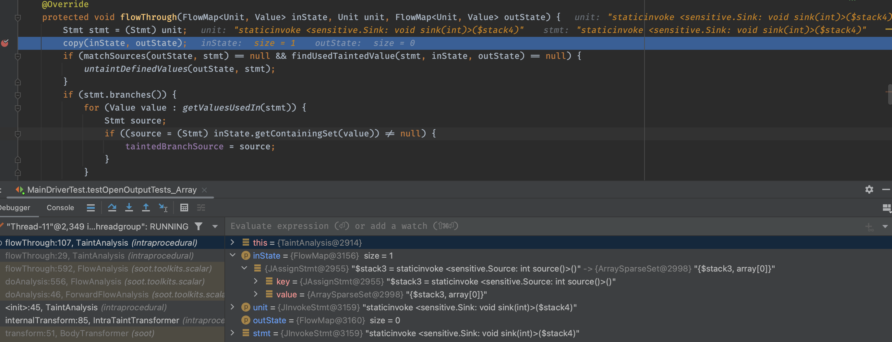
*Figure 16: Screenshot of IntelliJ IDEA debugger during execution of OpenOutputTests.array's last statement*

#### Discussion: 

This method does not have a leak because the Source value is stored in the first index of the array and the value passed to Sink is in the second index of the array. Figure 16 shows a screenshot of IntelliJ's debugging mode when the statement with a method call to Sink is being analysed. As shown in the image, the IN state includes $stack3 and array[0] but neither $stack4 nor array[1]. For this reason, we conclude our implementation successfully analyse leaks in arrays. 

On the other hand, Listing 3 shows a decompiled version of the array method, which includes some optimizations performed by the Java Compiler. I suspect that version of the code should result in the same Jimple we have, otherwise my implementation should have some difficulties detecting the leak. The main reason is that in the left hand side of the first statement we have the entire array, `var1`, being defined rather than a specific index. So the tainted value would be `var1`, which would trick my code into thinking there is no code (as `var1[1]` is not equals to `var1`).

### Deadcode

Source code: 
```Java
public void deadcode() {
   int a = Source.source();
   int b = 9;
   if (b > 10) {
      Sink.leak(a);
   }
}
```
*Listing 5: Fragment of code of the OpenOutputTests.deadcode method from InputSources*

Decompiled bytecode:
```Java
public void deadcode() {
   Source.source();
}
```
*Listing 6: Decompiled version of the optimized bytecode of OpenOutputTests.deadcode method from InputBytecodes*

Jimple:
```Scala
this := @this: OpenOutputTests
staticinvoke <sensitive.Source: int source()>()
i := @parameter0: int
return 1
return
goto [?= return]
return
i := @parameter0: int
return 1
return
```
*Listing 7: Fragment of the Jimple representation that corresponds to the OpenOutputTests.deadcode method*

#### Discussion

After compiling the source code in Listing 5 with Eclipse and decompiling it using IntelliJ (by simply opening a bytecode file in IntelliJ) we get the code in Listing 6. 
Notice, the Java Compiler optimizes the code removing all dead code, *i.e.*, all the code except for the method call in the first statement. 
Unlike the previous example, in which the Jimple code is more similar to the source code than the decompiled bytecode, the Jimple code shown in Listing 7 carries effects of the optimizations.
That being said, the dead code is handled by the compiler itself even before Soot's analysis.
So we conclude our implementation correctly shows there is no Leak in this method. 

### ObjectExample

Source code: 
```Java
public void objectExample() {
   Example example = new Example();
   example.setA(Source.source());
   Sink.sink(example.getA());
   Sink.sink(example.getB());

   example.b = Source.source();
   Sink.sink(example.getB());
}
```
*Listing 8: Fragment of code of the OpenOutputTests.objectExample method from InputSources*

Decompiled bytecode:
```Java
public void objectExample() {
   Example var1 = new Example();
   var1.setA(Source.source());
   Sink.sink(var1.getA());
   Sink.sink(var1.getB());
   var1.b = Source.source();
   Sink.sink(var1.getB());
}
```
*Listing 9: Decompiled version of the bytecode of OpenOutputTests.objectExample method from InputBytecodes*


Jimple:
```Scala
this.<Example: int a> = 1
return
this.<Example: int b> = 1
return
return
return 1
i := @parameter0: int
return
this := @this: Example
$stack1 = this.<Example: int a>
return $stack1
this := @this: OpenOutputTests
$stack2 = new Example
specialinvoke $stack2.<Example: void <init>()>()
$stack3 = staticinvoke <sensitive.Source: int source()>()
return 1
i := @parameter0: int
return
this := @this: Example
a := @parameter0: int
this.<Example: int a> = a
return
virtualinvoke $stack2.<Example: void setA(int)>($stack3)
return 1
this := @this: Example
i := @parameter0: int
return
$stack1 = this.<Example: int b>
return $stack1
$stack4 = virtualinvoke $stack2.<Example: int getA()>()
staticinvoke <sensitive.Sink: void sink(int)>($stack4)
$stack5 = virtualinvoke $stack2.<Example: int getB()>()
staticinvoke <sensitive.Sink: void sink(int)>($stack5)
this := @this: Example
b := @parameter0: int
this.<Example: int b> = b
return
$stack6 = staticinvoke <sensitive.Source: int source()>()
$stack2.<Example: int b> = $stack6
$stack7 = virtualinvoke $stack2.<Example: int getB()>()
staticinvoke <sensitive.Sink: void sink(int)>($stack7)
return
```
*Listing 10: Fragment of the Jimple representation that corresponds to the OpenOutputTests.objectExample method*

#### Discussion

The code in Listing 8 manipulates an object of type Example.
It sets the source output to the object's attribute A and then call the sink method twice passing A and B each time.
Unlike the other Open Output cases, this code contains a leak that my implementation cannot detect.
The reason is it does not support of interprocedural TaintAnalysis, which is a much more complex analysis than intraprocedural.
And interprocedural TaintAnalysis is out of this assignment's scope.
Threfore, we conclude our implementation, as any intraprocedural TainAnalysis, does not identify the leak present in this source code.
Incorporating interprocedural support for our code would involve
- handling the beggining and ending of each class definition 
- adapting FlowMap to store the states of static and non-static attributes.

Another clear challenge introduced by interprocedural analysis would be supporting language features that rely on execution time information, such as polymorphism that requires knowing the dynamic type of variables.